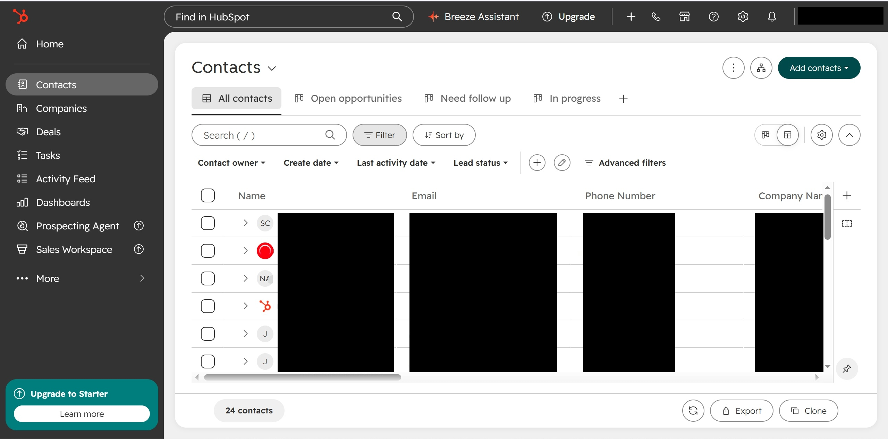
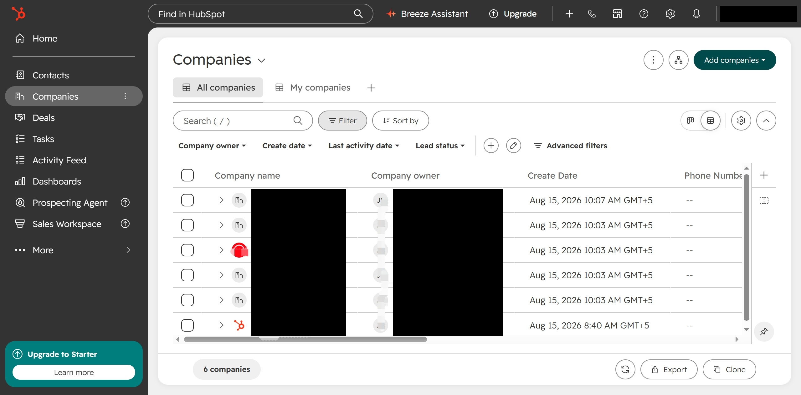
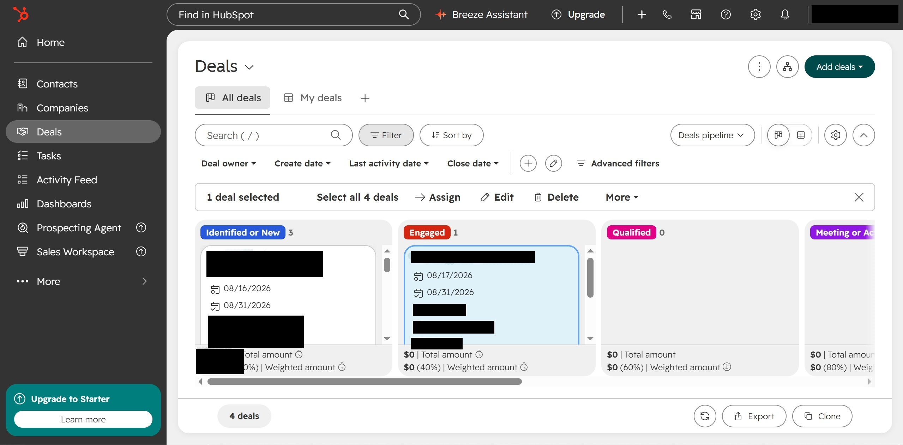

# HubSpot CRM Practice Project

This is a practice project in my own HubSpot Free account. All the data is sample data I made up. It is not client work.

## What I wanted to practice

Setting up a simple CRM for a membership business, where each person is one contact and can move from lead to paying member without duplicate records.

## What I have built so far

- Sample contacts, companies and deals (24 contacts, 6 companies, 4 deals)
- A custom deals pipeline with these stages: Identified or New, Engaged, Qualified, plus later stages

## Screenshots

Names, emails and other details are covered with black boxes.

## Still to do

- Lifecycle stages
- Custom properties for source and campaign
- Lists
- A test contact that goes from signup to paid member
